**运用Node手摸手教你写一个前端教程网站(遵循响应式)，包括前台内容和后台管理系统，整合Express框架和Mongodb数据库服务器开发；教你用Vue.JS，ElementUI和iViewUI写出超漂亮的页面**

**技术栈**

* 后端： Express + Mongodb + passport-jwt + jsonwebtoken等等

* 前端： Vue.JS + ElementUI + iViewUI + Axios等等

**测试环境**

VSCode + Node8.9.4 + Google(75.xxx) + VueCli(3.7.0)

**项目设计**

```
-- 后台基本架构
Node-Vue-App
├── README.md
├── server.js  -- 后台文件入口
├── test.http  -- 测试文件
├── api  -- 路由文件
│    ├── admin.js  -- 配置管理员的操作
│    ├── article.js  -- 配置文章的相关操作
|    ├── index.js  -- 配置首页的相关数据
|    ├── messagewall.js  -- 配置留言社区
|    ├── music.js  -- 配置歌曲信息
|    ├── user.js  -- 记录用户的信息,配置用户的相关操作
|    └── vipcourse.js  -- 配置VIP课程的相关操作
├── config -- 配置文件
|    ├── Date.js  -- 配置日期格式化插件
|    ├── http.js  -- 配置跨域
|    ├── delNoUseImg.js  --
|    ├── mrdir.js  --
|    ├── uploadImg.js  --
|    ├── uploadMedia.js  --
|    ├── keys.js  -- 配置token的签证密钥
|    └── MongodbURI.js  -- 配置Mongodb一些信息
├── model
|    └── **  -- 自定义数据库的Mongodb模型
├── mongodb
|    └── mongodb.js  -- 配置Mongodb,链接数据库 
├── passport
|    └── passport.js  -- 验证token的合法性
├── static
|    └── **  -- 资源存放处 
├── client
|    └── **  -- (Vue)前台页面构架
```
```
-- 前台页面架构
Client
├── README.md
├── public
|    ├── index.html  -- vue挂载页面
|    └── **  -- 你可以在这里链接少量静态资源
├── src  -- 开发文件夹
|    ├── App.vue  -- Vue挂载根页面
|    ├── http.js  -- 配置http,响应拦截操作
|    ├── main.js  -- Vue程序入口文件,挂载各种组件
|    ├── router.js  -- Vue路由配置文件
|    ├── store.js  -- Vuex的状态管理文件
|    ├── assets
|    |     └── **  -- 存放静态资源
|    ├── components
|    |     └── pcnav.vue  -- 导航栏
|    ├── myplugin  -- 配置插件
|    |     ├── Date.js  -- 格式化日期
|    |     └── Loading.js  -- 加载动画
|    ├── store  -- 状态储存
|    |     ├── adminstore.js  -- 管理员状态
|    |     ├── musicstore.js  -- 歌曲信息
|    |     ├── searchstore.js  -- 搜索信息
|    |     └── userstore.js  -- 用户信息
|    ├── views  -- 页面文件
|    |     ├── search.vue  -- 搜索页面
|    |     ├── NotFound.vue  -- 404页面
|    |     ├── Home.vue  -- 主页面
|    |     ├── Index.vue  -- 前端首页
|    |     ├── adminPage  -- 管理员
|    |     |     ├── adminindex.vue  -- 后台首页
|    |     |     ├── adminlogin.vue  -- 后台登录页面
|    |     |     ├── adminnav.vue  -- 后台导航栏
|    |     |     ├── index.vue  -- 后台根挂载点
|    |     |     ├── mainarea.vue  -- 后台页面主区域挂载点
|    |     |     └── components  -- 后台组件
|    |     |     |     ├── addarticle.vue  -- 添加文章
|    |     |     |     ├── buycourselogs.vue  -- 购买课程记录
|    |     |     |     ├── communitymessage.vue  -- 社区留言
|    |     |     |     ├── cssmessage.vue  -- VIP课程css留言
|    |     |     |     ├── editcss.vue  -- 编辑CSS文章
|    |     |     |     ├── edithtml.vue  -- 编辑HTML文章
|    |     |     |     ├── editjavascript.vue  -- 编辑Javascript文章
|    |     |     |     ├── homepagedata.vue  -- 前台主页数据管理
|    |     |     |     ├── htmlmessage.vue  -- VIP课程html留言
|    |     |     |     ├── jsmessage.vue  -- VIP课程JavaScript留言
|    |     |     |     ├── loginlog.vue  -- 登录日志
|    |     |     |     ├── managemusic.vue  -- 歌曲管理
|    |     |     |     ├── manageusers.vue  -- 用户管理
|    |     |     |     ├── operationlog.vue  -- 操作日志
|    |     |     |     ├── registerlog.vue  -- 注册日志
|    |     |     |     ├── signlog.vue  -- 签到日志
|    |     |     |     ├── specificarticles.vue  -- 账单管理
|    |     |     |     ├── vipcoursecss.vue  -- VIP(css)管理
|    |     |     |     ├── vipcoursehtml.vue  -- VIP(html)管理
|    |     |     |     └── vipcoursejs.vue  -- VIP(js)管理
|    |     ├── coursePage  -- 文章展示
|    |     |     ├── css.vue  -- css文章
|    |     |     ├── html5.vue  -- HTML文章
|    |     |     └── javascript.vue  -- Javascript文章
|    |     ├── userPage  -- 用户页面
|    |     |     ├── aboutme.vue  -- 作者
|    |     |     ├── enjoymusic.vue  -- 欣赏音乐
|    |     |     ├── messagewall.vue  -- 社区留言
|    |     |     ├── userinfo.vue  -- 个人资料
|    |     |     ├── userlogin.vue  -- 用户登录
|    |     |     ├── userregister.vue  -- 用户注册
|    |     |     └── vipcourse.vue  -- 看VIP课程
|    |     └── vipCoursePage  -- VIP课程页面
|    |     |     ├── csscourse.vue  -- css
|    |     |     ├── htmlcourse.vue  -- html
|    |     |     └── javascriptcourse.vue  -- javascript
├── babel.config.js  -- babel配置
└── vue.config.js  -- vue配置文件
```

<br/>

**项目测试介绍**

1. 本项目中后台使用3001端口, 请不要修改端口
2. 你需要在装有Node和Vue的环境中测试，如果其中一个没有请先下载([Node下载](https://nodejs.org/en/),[Vue下载](https://cn.vuejs.org/v2/guide/installation.html)).
3. 在根目录下载依赖:npm install 下载后端依赖, 接着进入client, npm install 下载前端依赖.
4. 配置数据库: 请将打包的数据JSON文件还原到Mongodb数据库中,请对应Mongodb配置的地址和数据库名,你也可以自定义地址和数据库名,一一对应即可.
5. 以上工作完成后,使用命令`npm run server 或者 node server`命令启动Node服务器，启动成功会显示:
    **Server is running on port [3001].
    **Mongodb is contected.
6. 进入client,打开命令板,使用命令`npm run client`启动vueCli-server，默认使用8080端口，启动成功后用浏览器访问`http://localhost:xxx`，如果首页数据展示成功,则证明数据和程序启动成功。
7. 本例中将Mongodb部署在本地电脑上，如果你仔细阅读了这篇文档，启动项目应该是很容易的。如果你把Mongodb部署在其他地方，请自行修改`config/mongodbURI.js`配置文件信息。
8. 只有完成了上述步骤后再启动项目，不然项目会因为连接不上Mongodb而报错。

# 准备

## passport-jwt和jsonwebtoken

jsonwebtoken是对用户信息加密成不可逆向破解的token.关于passport-jwt，是用来对用户请求时所带的token信息进行过期验证,如果超过签证的合法时间,则会请前台发出token失效的信息,提示用户重新获取合法的token信息,否则无法继续请求加密的信息；

- jsonwebtoken
```
// 设置token
// 规则
 const rule = {
    id:String(userinfo._id),
    username:userinfo.username,
    email:userinfo.email,
    date:user.date,
    signdate:userinfo.signdate,
    signcount:userinfo.signcount,
    avatar:userinfo.avatar,
    phone:userinfo.phone
};

// 签证加密
// jwt.sign(规则, key(私钥), {配置:比如过期时长}, (err, token){ 响应程序 })
jwt.sign(rule,key,{expiresIn:7200},(err, token) => {
    if(err) throw err;
    res.json({"token" : "Bearer " + token})
})
```
- passport-jwt
```
const key = require("../config/keys").KEYORSECRET;
const JwtStrategy = require('passport-jwt').Strategy,
      ExtractJwt = require('passport-jwt').ExtractJwt;
var opts = {}
opts.jwtFromRequest = ExtractJwt.fromAuthHeaderAsBearerToken();
opts.secretOrKey = key;

module.exports = passport => {
    passport.use(new JwtStrategy(opts, (jwt_payload, done) => {
        UserInfo.findById(jwt_payload.id)
                .then(user => {
                    if (user) {
                        return done(null, user);
                    } else {
                        return done(null, false);
                        // or you could create a new account
                    }
                })
    }));
}
```
详细的文档地址：[Passport-Jwt合法验证](https://www.npmjs.com/package/passport-jwt),[token加密](https://www.npmjs.com/package/jsonwebtoken)


<br/>

## svg-captcha

svg-captcha验证码的运用,防止暴力破解密码,加强安全性.
详细的文档地址：[svg-captcha](https://www.npmjs.com/package/svg-captcha)

**使用验证码**
```
// 后台生成验证码
router.get("/getCaptcha", (req, res) => {
    var captcha = svgCaptcha.create({  
        // 翻转颜色  
        inverse: false,  
        // 字体大小  
        fontSize: 38,  
        // 噪声线条数  
        noise: 3,  
        // 宽度  
        width: 80,  
        // 高度  
        height: 32,  
      });  
      // 保存到session,忽略大小写  
      req.session = captcha.text.toLowerCase(); 
      console.log(req.session); //0xtg 生成的验证码
      //保存到cookie 方便前端调用验证
      res.cookie('captcha', req.session); 
      res.setHeader('Content-Type', 'image/svg+xml');
      res.send(String(captcha.data));
      res.end();
})


// 前台获取验证码
--HTML


--js
// 获取验证码cookie
getCookie(cname){
    var name = cname + "=";
    var ca = document.cookie.split(';');
    for(var i=0; i<ca.length; i++){
        var c = ca[i].trim();
        if (c.indexOf(name)==0) return c.substring(name.length,c.length);
    }
    return "";
},
// 刷新验证码
refreshCaptcha(){
    this.$refs.captcha.src = "http://localhost:3001/api/user/getCaptcha?d=" + Math.random();
},

最后用 填写的验证码进行对比
```
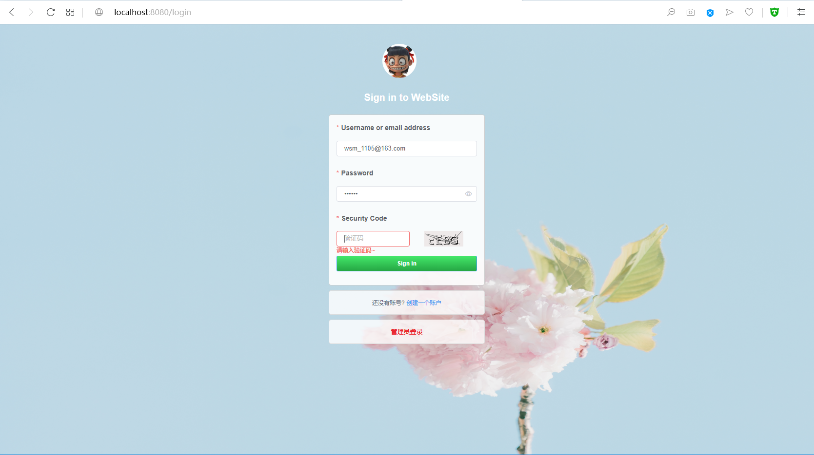
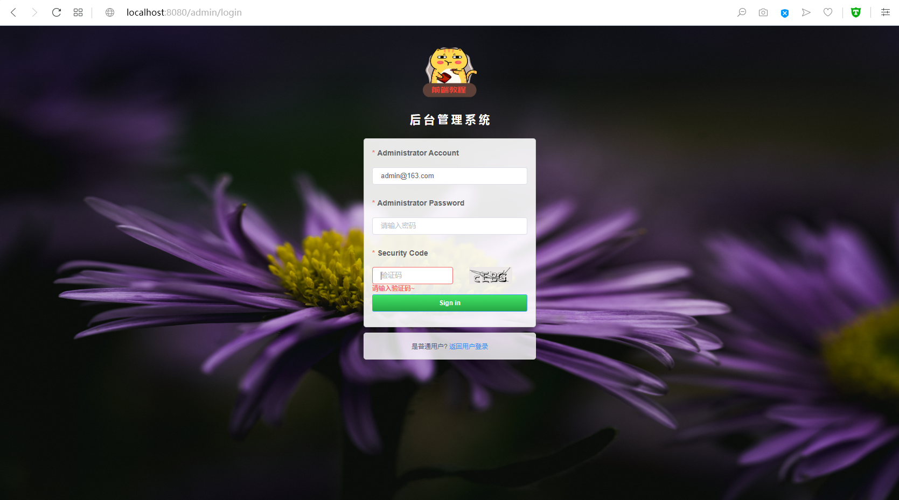
**控制台**


<br/>

## Vue、ElementUI分页使用

关于ElementUI分页详细请见：[ElementUI的Pagination分页学习](https://element.eleme.cn/#/zh-CN/component/pagination)

```
-- html
<el-pagination
    v-if='paginations.total > 0'
    :page-sizes="paginations.page_sizes"
    :page-size="paginations.page_size"
    :layout="paginations.layout"
    :total="paginations.total"
    :current-page.sync='paginations.page_index'
    @current-change='handleCurrentChange'
    @size-change='handleSizeChange'>
</el-pagination>

-- js
data(){
    return{
        allUsers:[],  // 用来存储最终信息, 被显示的dom点调用
        allTableData:[],  // 用户承接分页设置的数据
        paginations: {   // 分页组件信息
            page_index: 1, // 当前位于哪页
            total: 0, // 总数
            page_size: 5, // 1页显示多少条
            page_sizes: [5, 10, 15, 20], //每页显示多少条
            layout: "total, sizes, prev, pager, next, jumper" // 翻页属性
        },
    }
},
methods:{
    // 获取当前页
    handleCurrentChange(page) {
        let sortnum = this.paginations.page_size * (page - 1);
        let table = this.allTableData.filter((item, index) => {
            return index >= sortnum;
        });
        // 设置默认分页数据
        this.getAllUsers = table.filter((item, index) => {
            return index < this.paginations.page_size;
        });
        this.getAllUsers = table.filter((item, index) => {
            return index < this.paginations.page_size;
        });
    },
    // 切换size
    handleSizeChange(page_size) {
        this.paginations.page_index = 1;
        this.paginations.page_size = page_size;
        this.getAllUsers = this.allTableData.filter((item, index) => {
            return index < page_size;
        });
    },
     // 总页数
    setPaginations() {
        this.paginations.total = this.allTableData.length;
        this.paginations.page_index = 1;
        this.paginations.page_size = 5;
        // 设置默认分页数据
        this.getAllUsers = this.allTableData.filter((item, index) => {
            return index < this.paginations.page_size;
        });
    },
}
```


>没了吗?对,分页就是这么简单!你学会了吗?

##### 对于项目中其他特殊比较复杂的功能,还请您先测试后再进行学习,代码注释很清晰,如果哪里不懂请看下方联系方式

<br/>

# 项目截图

- 首页(懒加载)
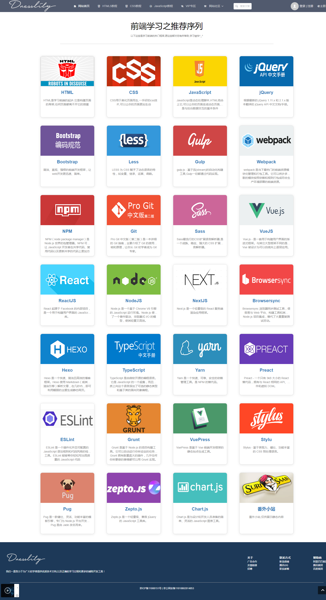

- HTML教程
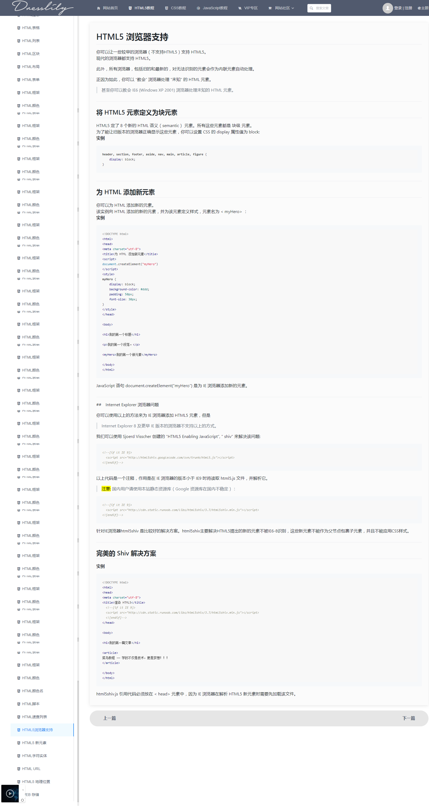

- 留言墙
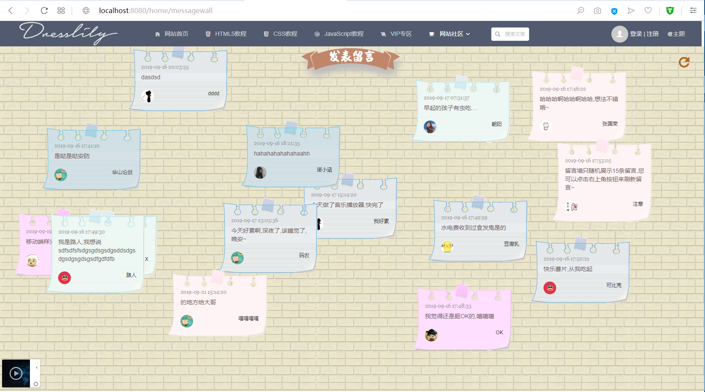
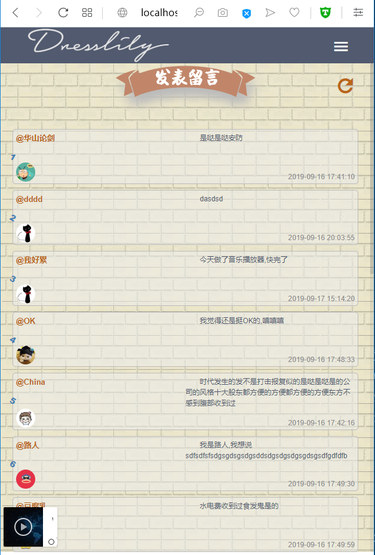
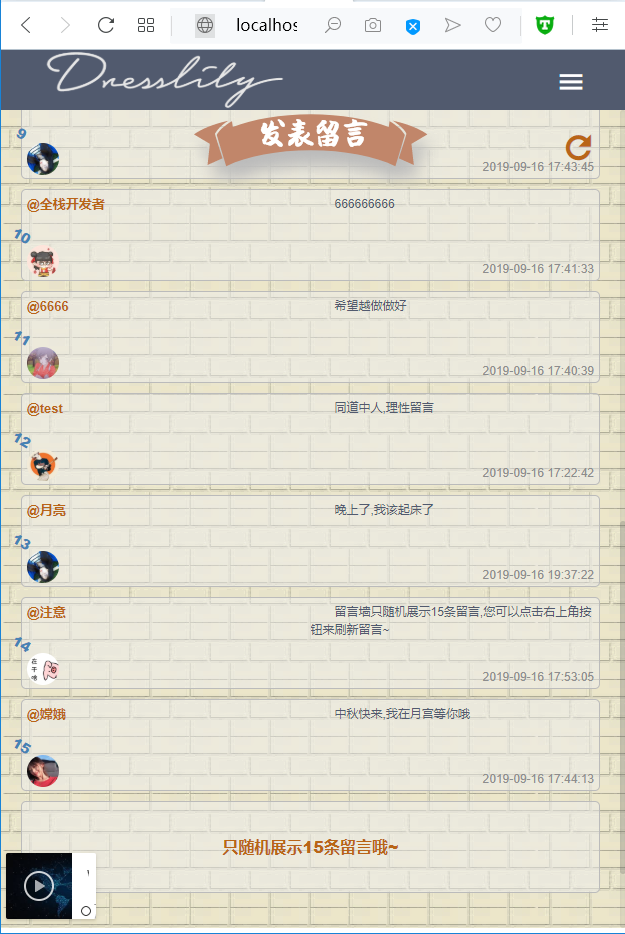

- 欣赏歌曲
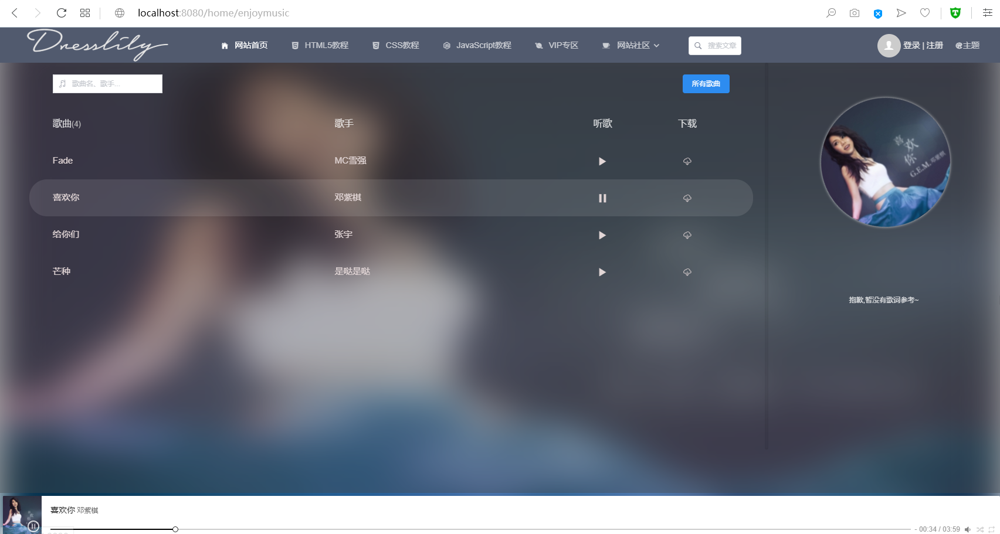
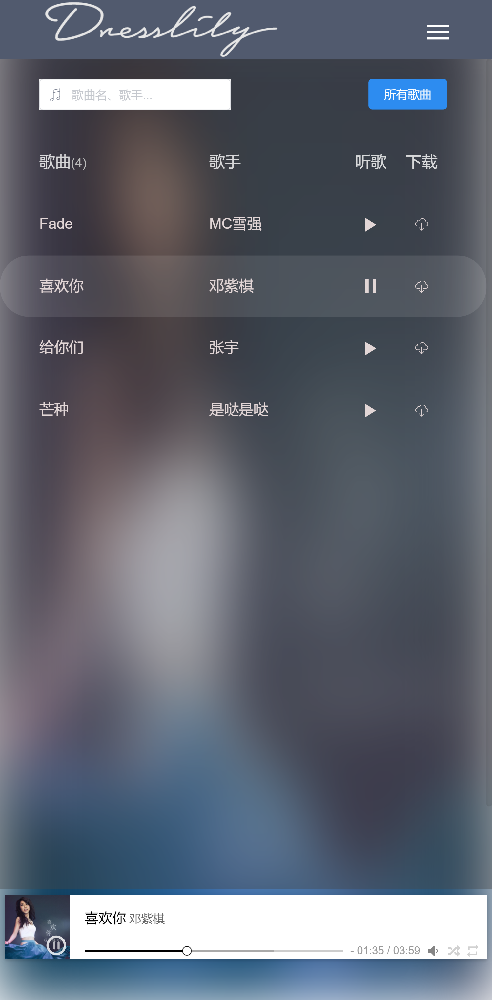

- 每日签到
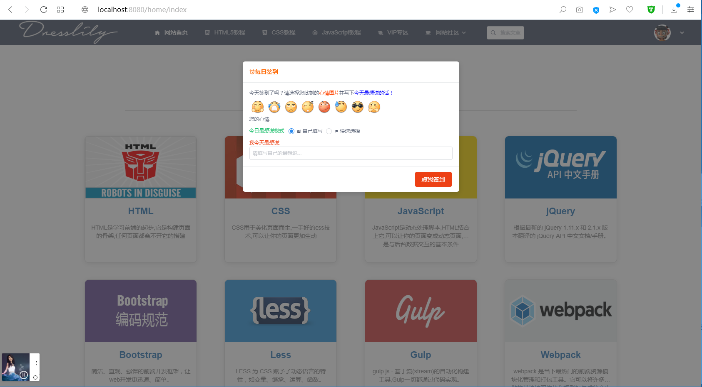

- 个人信息
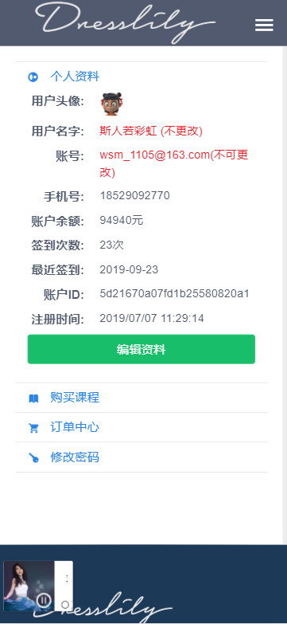


- VIP课程

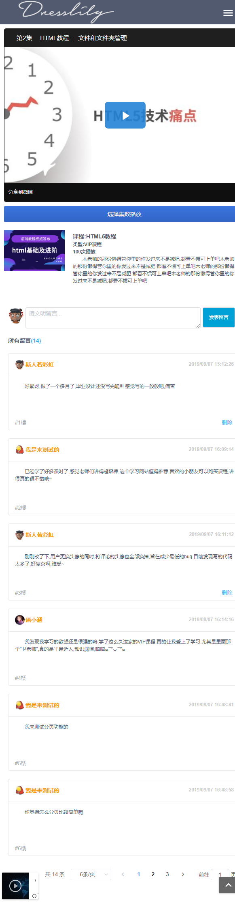

- 搜索页面
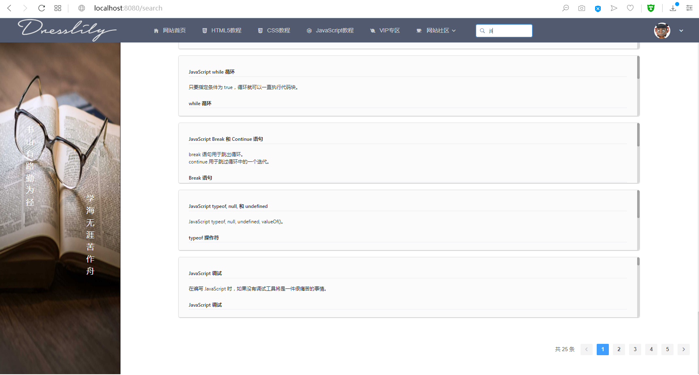

- 404
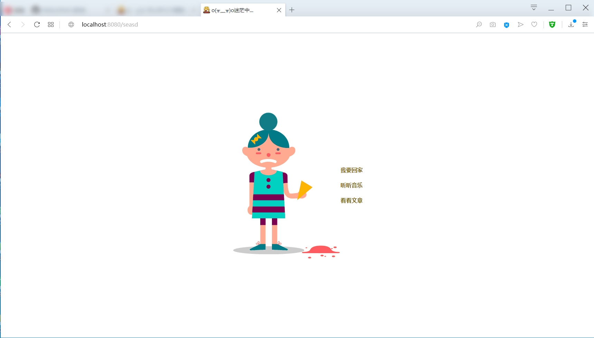


#### 后台界面
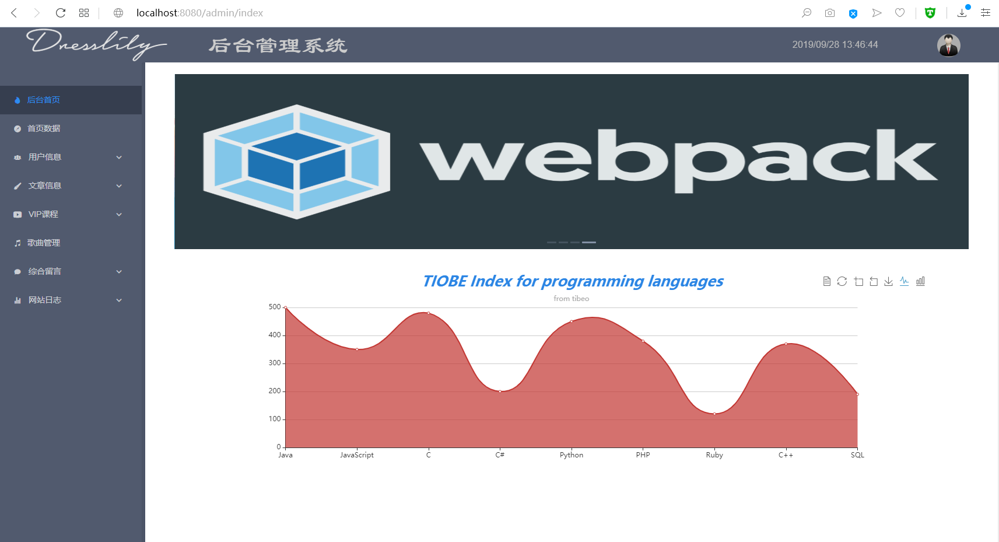
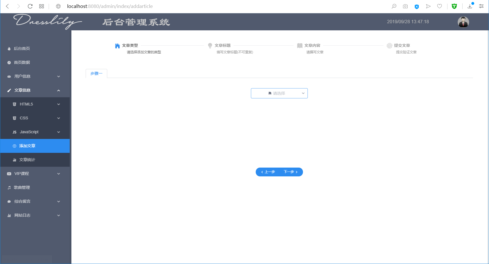
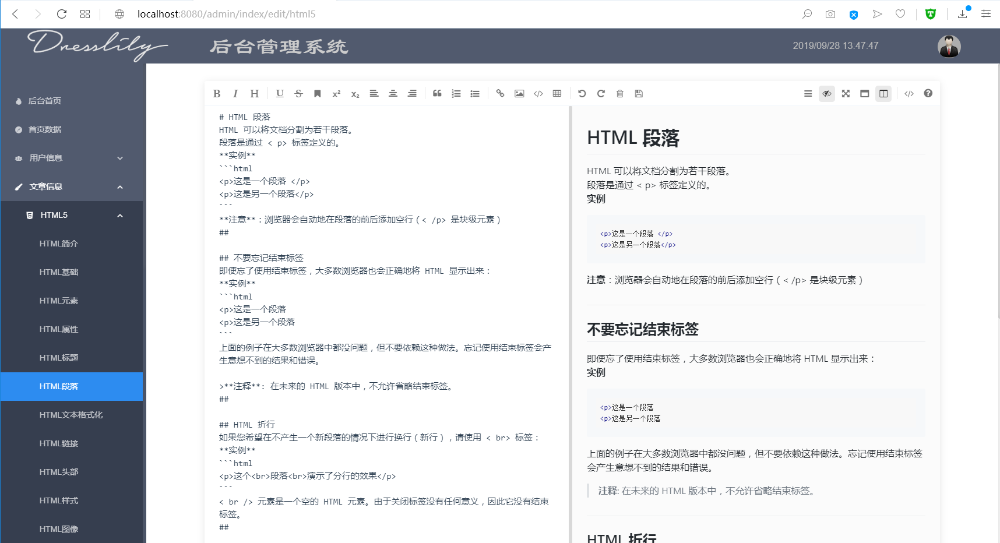
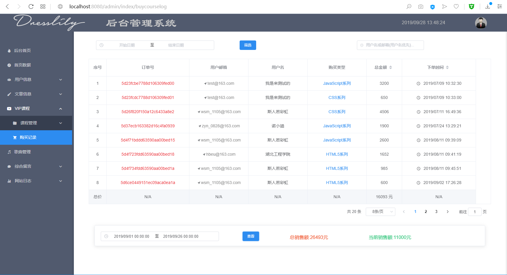
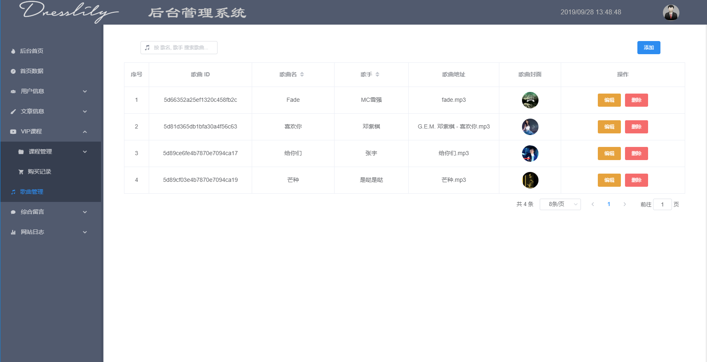

等等


<br/>

# 交流

如果大家有兴趣，[欢迎star](http://github.com/1046224544/fontend/). 欢迎大家加入我的前端交流群：866068198 ，一起交流学习前端技术。博主目前一直在自学Node中，技术有限，如果可以，会尽力给大家提供一些帮助，或是一些学习方法.
- 群二维码
  

<br/>

# 联系

If you have some questions after you see this article, you can contact me or you can find some info by clicking these links.

- [juejin@wsm's juejin](https://juejin.im/user/5d1079ab6fb9a07ed4410cc0)
- [GitHub@1046224544](https://github.com/1046224544)
- [Segmentfault@wsm](https://segmentfault.com/u/xiaolajiao_5d81dbf1f09b2)


